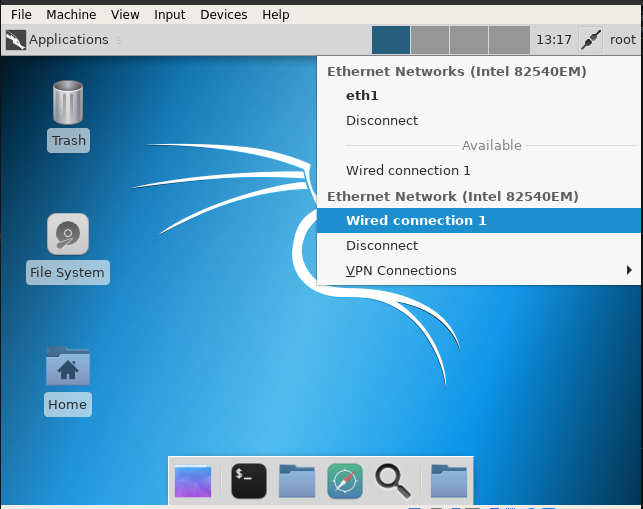

# Win Domain Lab

## Description

This lab provides a complete sample of a Windows environment including a Windows Domain.

This lab has been created to test attack detection using Windows logs but can be used for any test in a Windows environment.

## Requirements

This labs requires the boxes from the [Build Boxes](https://github.com/df3l0p/build-boxes) project for the Windows part, and an Internet connection for the download of the Kali box and the different tools at build time.

## Features

This lab contains 4 machines:

* 1 domain controller: dc (Windows 2019)
* 1 Windows server (centralizing logs): wef (windows 2019)
* 1 Kali machine (hosting Splunk for the log part): logger (Kali)
* 1 (or more) Windows workstation(s): win10-1 (Windows 10 Enterprise)

Each Windows machines is configured with Sysmon and sends its logs to the central collector (wef). The logs are then sent to Splunk hosted on the Kali Linux. As the first purpose of this Lab was to develop use cases for attack detection, the Linux box is a Kali machine. Therefore, it is is easy to deploy attack tools on the lab.

After the build, Splunk will be available on http://192.168.39.105:8000 using the following credentials (admin/changeme).

A second version (with 2 Windows forest) is also provided and including:

* 2 domain controllers (1 for each forest): dc, dc_rf
* 2 workstations (1 in each forest): win10, win10_rf

## Credits/Resources

The inspiration for this lab come from the [Detection Lab](https://github.com/clong/DetectionLab/) project.

## Acknowledgements

* Splunk - https://www.splunk.com
* Sysmon - https://docs.microsoft.com/en-us/sysinternals/downloads/sysmon
* Kali Linux - https://www.kali.org/
* Eric Zimmerman forensic toolbox - https://ericzimmerman.github.io/


## Known issues

### Kali box stuck at ssh connections

For an unknown reason, the Kali Linux box might be stuck at boot when trying to connect through SSH.

```bash
[snip]
==> logger: Waiting for machine to boot. This may take a few minutes...
    logger: SSH address: 127.0.0.1:2200
    logger: SSH username: vagrant
    logger: SSH auth method: private key
[snip]
```

When that happens, simply open the GUI Kali box, login using the default Kali credential and enable network connection by clicking on "Wired Connection 1"


